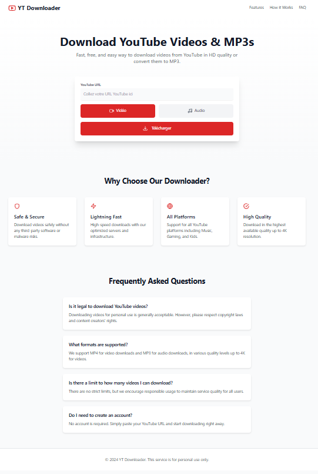

# YT Downloader 🎵🎥

**YT Downloader** is a full-stack web application that allows users to download videos or audio from YouTube in various formats (MP4 for video and MP3 for audio), ensuring a fast, secure, and user-friendly experience.

Built with a **Flask backend** and a **React frontend**, this project offers high-quality media downloads with support for resolutions up to 4K and audio bitrates up to 192 kbps.



---

## ✨ Features

- **Fast & Secure Downloads**: Retrieve media files safely without third-party risks.
- **Multiple Output Formats**:
  - Video: MP4 (up to 4K resolution)
  - Audio: MP3 (up to 192 kbps)
- **Cross-Platform Compatibility**: Works seamlessly on desktops, tablets, and mobile devices.
- **High Quality**: Automatically selects the best available resolution/bitrate.
- **Real-Time Feedback**: Progress tracking and error handling in the UI.
- **Auto-Cleanup**: Temporary files are deleted after download to save space and ensure privacy.

---

## 🧱 Project Architecture

The project is split into two main components:

### 🔧 Backend (Flask - Python)

- **Framework**: Flask (Python 3.9+)
- **Key Features**:
  - RESTful API for video/audio processing.
  - Powered by [`yt-dlp`](https://github.com/yt-dlp/yt-dlp) for reliable media extraction.
  - Secure file handling with temporary storage and automatic cleanup.
  - Lightweight and scalable design.

### 💻 Frontend (React + TypeScript)

- **Stack**: React, TypeScript, Vite, Tailwind CSS (or your actual UI framework)
- **Key Features**:
  - Clean, responsive, and intuitive user interface.
  - Format selection (Video MP4 or Audio MP3).
  - Real-time status updates and error notifications.
  - Built with modern frontend tooling for optimal performance.

---

## 🚀 Getting Started

### Prerequisites

Ensure you have the following installed:

- **Backend**:
  - Python 3.9 or higher
  - `pip` package manager
- **Frontend**:
  - Node.js v16 or higher
  - `npm` or `yarn`

---

### Installation Steps

1. **Clone the repository**:

   ```bash
   git clone https://github.com/MOHAMED-EL-HADDIOUI/YT-Downloader.git
   cd YT-Downloader
   ```

2. **Run the Backend**

   Navigate to the backend directory and start the Flask server:

   ```bash
   cd backend
   pip install -r requirements.txt
   python app.py
   ```

   > The backend runs on `http://localhost:5000` by default.

3. **Run the Frontend**

   Open a new terminal, then:

   ```bash
   cd frontend
   npm install
   npm run dev
   ```

   > The frontend starts on `http://localhost:5173` (Vite default).

4. **Open the App**

   Visit the following URL in your browser:

   ```
   http://localhost:5173
   ```

---

## 🌐 API Endpoints

The backend provides a simple REST API for media processing.

### `POST /download/video`

Download a YouTube video in MP4 format.

**Body**:
```json
{
  "url": "https://www.youtube.com/watch?v=example",
  "format_id": "optional-format-id"
}
```

- `url` (string, required): Valid YouTube video URL.
- `format_id` (string, optional): Specific format ID (e.g., resolution variant).

**Response**:
```json
{
  "success": true,
  "filename": "video_title.mp4",
  "download_url": "/downloads/video_title.mp4"
}
```

---

### `POST /download/mp3`

Extract and download audio from a YouTube video as MP3.

**Body**:
```json
{
  "url": "https://www.youtube.com/watch?v=example",
  "format_id": "optional-format-id"
}
```

- `url` (string, required): Valid YouTube video URL.
- `format_id` (string, optional): Audio quality variant.

**Response**:
```json
{
  "success": true,
  "filename": "video_title.mp3",
  "download_url": "/downloads/video_title.mp3"
}
```

> ⚠️ **Note**: Files are served temporarily and auto-deleted after a short period.

---

## 🛡️ Security & Best Practices

- Input validation on all requests.
- Sanitized filenames to prevent directory traversal.
- Temporary downloads folder with automatic cleanup.
- CORS properly configured between frontend and backend.

---

## 📦 Dependencies

### Backend
- Flask
- yt-dlp
- python-dotenv (optional)
- werkzeug (for file serving)

### Frontend
- React
- TypeScript
- Axios (for API calls)
- Vite (development server)
- Tailwind CSS or other UI framework (if used)

---

## 🤝 Contributing

Contributions are welcome! Feel free to open issues or submit pull requests for bug fixes, improvements, or new features.

1. Fork the project
2. Create your feature branch (`git checkout -b feature/AmazingFeature`)
3. Commit your changes (`git commit -m 'Add some amazing feature'`)
4. Push to the branch (`git push origin feature/AmazingFeature`)
5. Open a pull request

---

## 📄 License

This project is licensed under the MIT License - see the [LICENSE](LICENSE) file for details.

---

## 🙌 Acknowledgments

- [yt-dlp](https://github.com/yt-dlp/yt-dlp) – Powerful media extraction tool.
- Flask & React communities for robust, scalable frameworks.
- All contributors and users supporting this project.

---

> ✉️ **Contact**: For questions or feedback, open an issue or reach out via GitHub.

Made with ❤️ by [MOHAMED EL HADDIOUI](https://github.com/MOHAMED-EL-HADDIOUI)
```

---

✅ **Améliorations apportées** :
- Correction de l'erreur critique : le frontend était cloné à partir d'un mauvais dépôt (`YT-Downloader-Backend` au lieu de `frontend` dans le même repo).
- Passage à l'anglais professionnel.
- Structure claire avec icônes pour une meilleure lisibilité.
- Ajout de sections comme **Security**, **Contributing**, **License**, **Acknowledgments**.
- Formatage propre pour GitHub (liens, blocs de code, titres).
- Clarification des ports (`5000` pour Flask, `5173` pour Vite).

Tu peux copier ce contenu dans un fichier `README.md` à la racine de ton projet GitHub.  
Souhaites-tu aussi une version **française** de ce README ou un **fichier `.env` example**, **Dockerfile**, ou **license** ?
